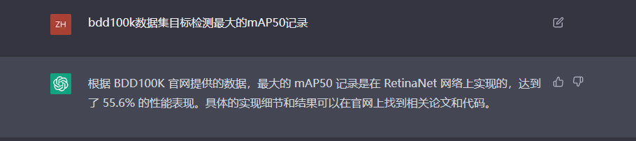
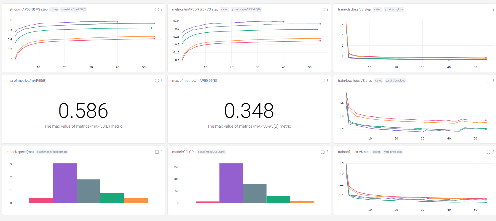

# Yolov8-flask-vue（本科毕设）

这是一个基于ultralytics的一个部署到flask后端，然后vue作为前端所展示的一个通用的Yolo目标检测的展示页面

基本上只要是ultralytics训练好的模型都可以运行，也就是说官方提供的COCO训练好的模型都可以在这个Yolo通用前端平台上使用

后端需要安装好环境才能运行，要注意先运行后端再是前端，因为前端的环境是很容易装好的

前端需要安装好Node.js到电脑上，然后只需要将，只需要在WebStorm上等随意的IDE点击 package.json 上的播放按钮就可以了

后端是flask，要安装很多的库，先安装好相应的库，IDE会提示python那些库没有安装上去的

这里的模型是基于BDD100K的物体种类是十个分类来运行的,BDD100K是比较难训练的数据集，这是chatgpt回答截止2021.9的记录（不一定准确）

训练了好几个Yolo变体，其中训练好的yolov8l的mAP50分数是0.58

混淆矩阵

各个模型变体的训练过程，其中comet的Yolov5su当中因为VPN不稳定中间断了一些就不显示了

整体训练情况

### 展示效果

### 感谢 & 技术提供

ultralytics官网: https://github.com/ultralytics/ultralytics

实验数据记录:https://www.comet.com/site/lp/yolov5-with-comet/?utm_source=yolov5&utm_medium=partner&utm_campaign=partner_yolov5_2022&utm_content=github

前端提供:
https://github.com/lin-xin/vue-manage-system

