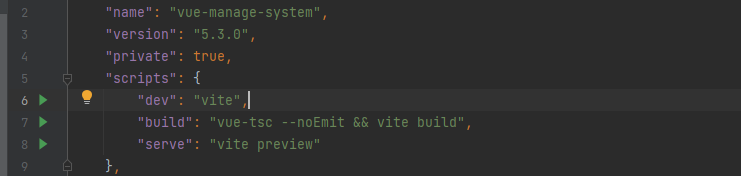
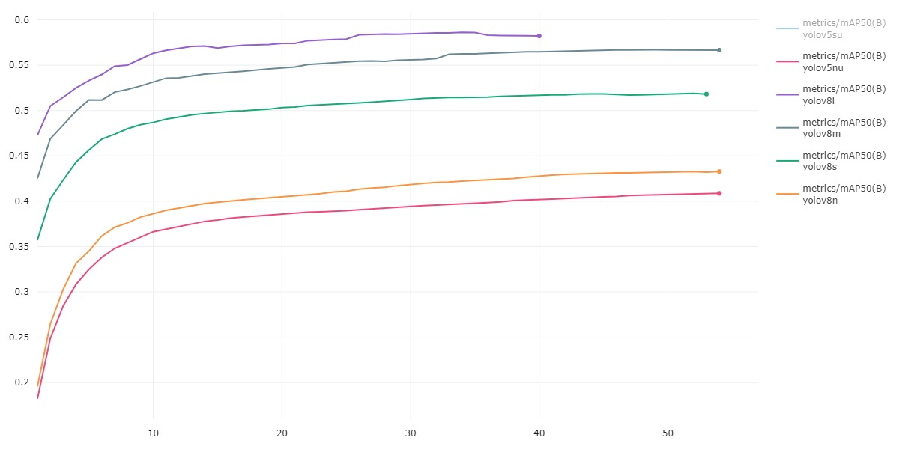
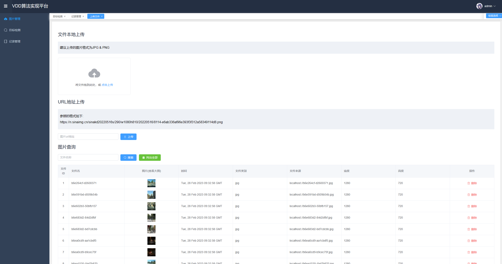
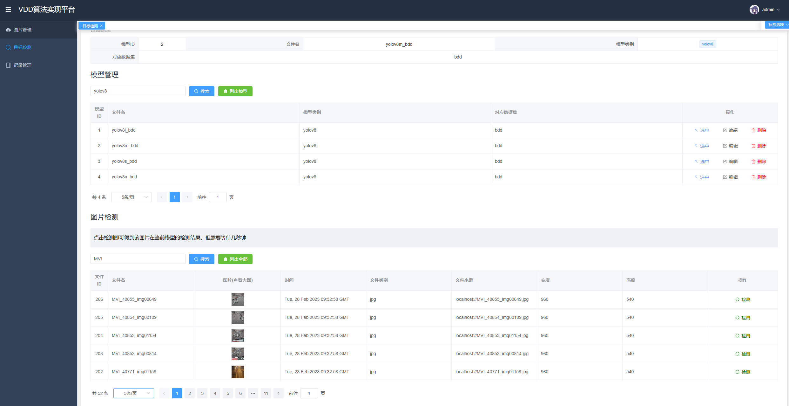
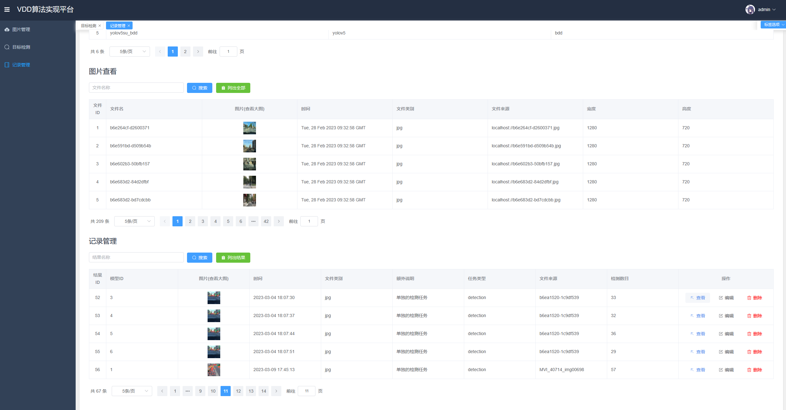
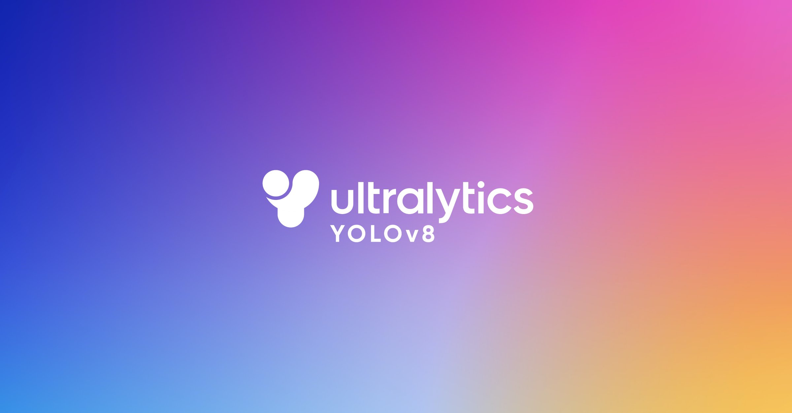
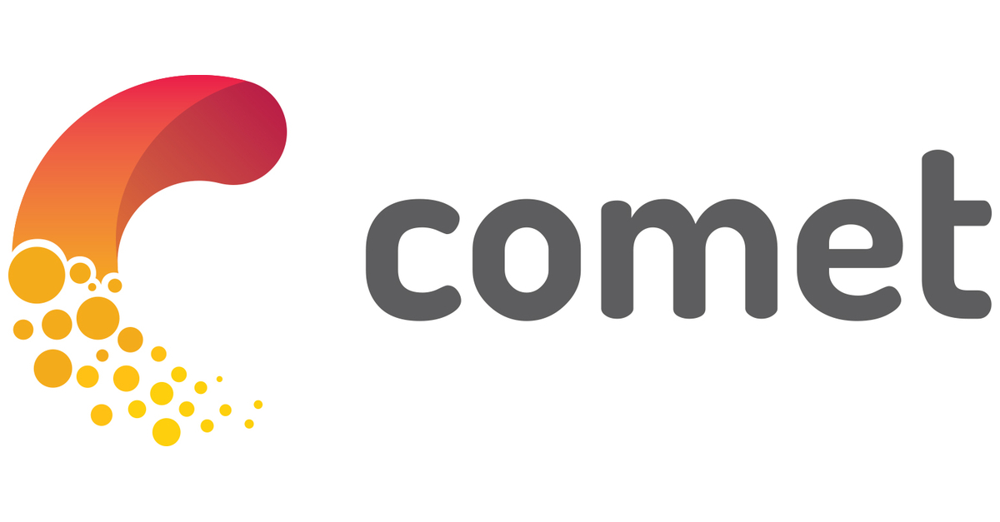

# Yolov8-flask-vue（本科毕设）

这是一个基于ultralytics的一个部署到flask后端，然后vue作为前端所展示的一个通用的Yolo目标检测的展示页面

基本上只要是ultralytics训练好的模型都可以运行，也就是说官方提供的COCO训练好的模型都可以在这个Yolo通用前端平台上使用

后端需要安装好环境才能运行，要注意先运行后端再是前端，因为前端的环境是很容易装好的

前端需要安装好Node.js到电脑上，然后只需要将，只需要在WebStorm上等随意的IDE点击 package.json 上的播放按钮就可以了

后端是flask，要安装很多的库，先安装好相应的库，IDE会提示python那些库没有安装上去的

这是毕设模型变体的训练过程，其中comet的Yolov5su当中因为VPN不稳定中间断了一些就不显示了

个人毕设训练这些模型不方便公开，这里只是提供了一个通用的YOLO实现平台，可以将自己训练好的模型放入到上面去来实现目标检测展示功能

图片上传来自于本地或者是url地址，但url地址有着严格要求

图片上传后不能修改名称，除非删除再上传，同理，模型也是如此

### 展示效果

### 个人环境

#### 开发技术及工具的选择：

Windows 11

Python 3.9.13

Pytorch 1.13.1+cu117

Jetbrains-IDEA系列2022

#### 开发环境：

硬件：电脑内存32G左右，GPU RTX A5000

Windows 11以上操作系统；

软件： Anaconda22.9.0 + python3.9.13 + Pytorch1.13.1+cu117 + Pycharm(或者是DataSpell) + WebStorm + Node.js 18.14.1 (x64)

### 后续说明

后面会对这个项目细节相关进行说明

### 感谢 & 技术提供

ultralytics官网: https://github.com/ultralytics/ultralytics

实验数据记录: https://www.comet.com/site/lp/yolov5-with-comet/?utm_source=yolov5&utm_medium=partner&utm_campaign=partner_yolov5_2022&utm_content=github

前端提供:
https://github.com/lin-xin/vue-manage-system

